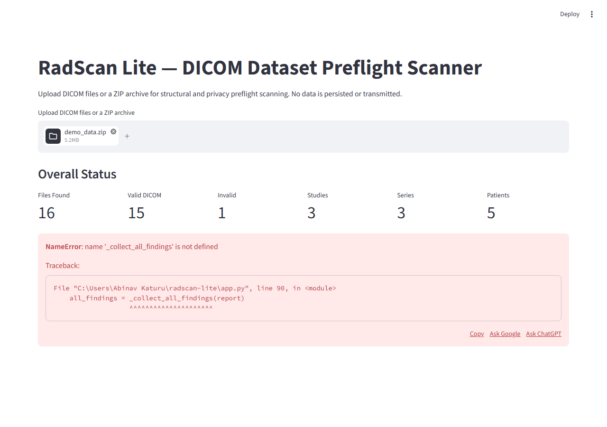

# RadScan Lite

[](https://github.com/AKaturu/radscan-lite/actions/workflows/ci.yml)
[](https://www.python.org/)
[](LICENSE)

A local, read-only DICOM dataset preflight scanner for radiology researchers.

RadScan Lite inspects DICOM folders and ZIP archives for structural problems, series inconsistencies, duplicate identifiers, pixel decoding failures, and potential privacy risks before a dataset is shared, analyzed, or used in research tooling.

> Not a medical device. Does not diagnose disease. Does not establish HIPAA compliance. All findings require appropriate local review.

## Screenshots

| Scan Results | Findings | Privacy Review |
|---|---|---|
|  |  |  |

## What It Checks

| Area | Examples |
|---|---|
| File validity | DICOM readability, preamble/header issues, required UID presence |
| Pixel data | Dimensions, bit depth, transfer syntax, photometric interpretation, decoding failures |
| Dataset integrity | Duplicate SOP Instance UIDs, hash mismatches, missing identifiers |
| Series consistency | Rows/columns, pixel spacing, orientation, frame of reference, instance ordering |
| Privacy review | PHI field presence, private tags, burned-in annotation flags, de-identification metadata |
| Archive safety | ZIP path traversal prevention, compression-ratio limits, temporary cleanup |

## Download and Install

### Option 1: One-Click Install

Requires Python 3.11 or newer.

| Platform | How to install |
|---|---|
| Windows | Double-click `install.bat` or run `install.bat` |
| macOS/Linux | Run `chmod +x install.sh && ./install.sh` |

The installer verifies Python, creates a virtual environment, installs dependencies, and launches the app.

### Option 2: Development Install

```bash
git clone https://github.com/AKaturu/radscan-lite.git
cd radscan-lite
python -m pip install --upgrade pip
python -m pip install -e ".[dev]"
streamlit run app.py
```

Optional JPEG-LS/JPEG-2000 support:

```bash
python -m pip install -e ".[pylibjpeg]"
```

### Option 3: Docker

```bash
docker build -t radscan-lite .
docker run --rm -p 8501:8501 radscan-lite
```

Then open [http://localhost:8501](http://localhost:8501).

### Option 4: Standalone Executable

Build a single-file executable with PyInstaller:

| Platform | Command | Output |
|---|---|---|
| Windows | `packaging\build_windows.bat` | `dist\RadScanLite.exe` |
| macOS | `bash packaging/build_macos.sh` | `dist/RadScanLite.app` |
| Linux | `bash packaging/build_linux.sh` | `dist/RadScanLite` |

Prerequisite:

```bash
python -m pip install -e ".[packaging]"
```

## Repository Guide

| Path | Purpose |
|---|---|
| `app.py` | Streamlit user interface |
| `run_radscan.py` | CLI launcher |
| `radscan_lite/scanner.py` | Main scan orchestration |
| `radscan_lite/*_checks.py` | File, series, privacy, and archive checks |
| `radscan_lite/reporting.py` | JSON/CSV report generation |
| `scripts/generate_synthetic_data.py` | Synthetic demo-data generator |
| `demo_assets/` | Screenshots, demo ZIP, and sample reports |
| `tests/` | Scanner and security regression tests |

## Test Commands

```bash
python -m ruff check radscan_lite tests scripts
python -m mypy radscan_lite
python -m pytest -q
```

Optional coverage:

```bash
python -m pytest -q --cov=radscan_lite
```

GitHub Actions runs linting, type checks, and tests on Python 3.11 and 3.12.

## Privacy and Security

- Processing is local.
- Uploaded files are not intentionally transmitted.
- PHI values are never displayed, logged, or exported.
- ZIP path traversal and high-compression archive attacks are blocked.
- Temporary directories are cleaned after each session.
- Reports contain findings and metadata summaries, not raw PHI values.

See [SECURITY.md](SECURITY.md) for reporting guidance.

## Limitations

- Does not diagnose disease.
- Does not modify DICOM files.
- Does not certify HIPAA compliance or de-identification completeness.
- Pixel decoding depends on installed transfer-syntax support.
- Thumbnails are for technical review only.

## Contributing

See [CONTRIBUTING.md](CONTRIBUTING.md). Please use synthetic data for issues, pull requests, screenshots, and tests.

## License

MIT. See [LICENSE](LICENSE).
